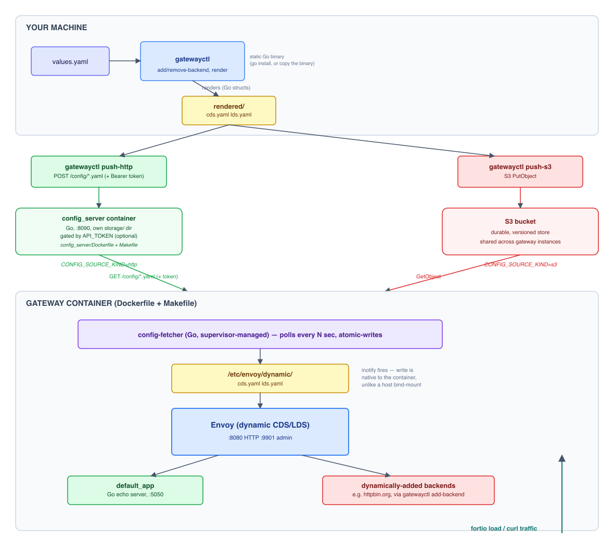

# Architecture



```
gatewayctl (host)                                  Envoy container
  add-backend/remove-backend                     +-------------------------------+
        |                                         | config-fetcher (supervisor)  |
        v                                         |   polls HTTP or S3           |
  config/values.yaml -> render -> rendered/{cds,lds}.yaml |   atomic-writes into -v |
        |                                         v                          |   |
        |                              /etc/envoy/dynamic  <------------------+
        |  HTTP: gatewayctl push-http uploads to config_server's own storage/       |
        |  S3:   gatewayctl push-s3 uploads rendered/ to a bucket                  v
        +------------------------------------------------------> Envoy inotify watch -> hot-reload
```

Clusters and routes are **not** static in `config/envoy.yaml`. The bootstrap
only points `dynamic_resources.cds_config` / `lds_config` at
`/etc/envoy/dynamic/{cds,lds}.yaml` inside the container, with
`watched_directory` set so Envoy watches that directory via inotify.

`config/dynamic` is **not** bind-mounted from the host. On Docker Desktop
for Mac, host-side writes into a bind-mounted directory sync file content
into the container but do not reliably propagate the underlying inotify
event, so Envoy never notices the change even though the file is correct.
Instead, the `fetcher/` binary (compiled Go, statically linked) runs
*inside* the container (via `supervisor.ini`) and polls a remote source for
`cds.yaml`/`lds.yaml`, writing them into `/etc/envoy/dynamic` itself - a
write native to the container's own filesystem, which does trigger Envoy's
inotify watch. `gatewayctl` on the host only ever writes to
`config/values.yaml` and the local `rendered/` directory; it never touches
the container's
filesystem directly. Both `gatewayctl` and the fetcher write atomically
(temp file + rename, not delete-then-write) so a reader never observes a
missing or partial file mid-swap.

Two distribution mechanisms are supported, selected by the
`CONFIG_SOURCE_KIND` env var on the container. Both are cloud-agnostic
(no dependency on a specific provider) and both require an explicit push
after each change - `gatewayctl` never touches the container or the fetcher's
source directly, only the distribution endpoint:

- **`http`** - the fetcher polls `config_server`, a small Go HTTP service
  with its own `storage/` directory (has its own `Dockerfile`/`Makefile` -
  deployable as its own service). `gatewayctl push-http` uploads
  `rendered/cds.yaml`/`lds.yaml` to it over HTTP POST. The server doesn't
  need to be colocated with `gatewayctl` - anywhere reachable over HTTP
  works, which is what makes this option cloud-agnostic (no S3/GCS/Azure
  dependency at all). Optionally gated by `API_TOKEN` (see the main
  README).
- **`s3`** - the fetcher polls an S3 bucket. `gatewayctl push-s3` uploads
  `rendered/` there instead. Useful once you want config shared across
  multiple gateway instances via a durable, versioned store.
